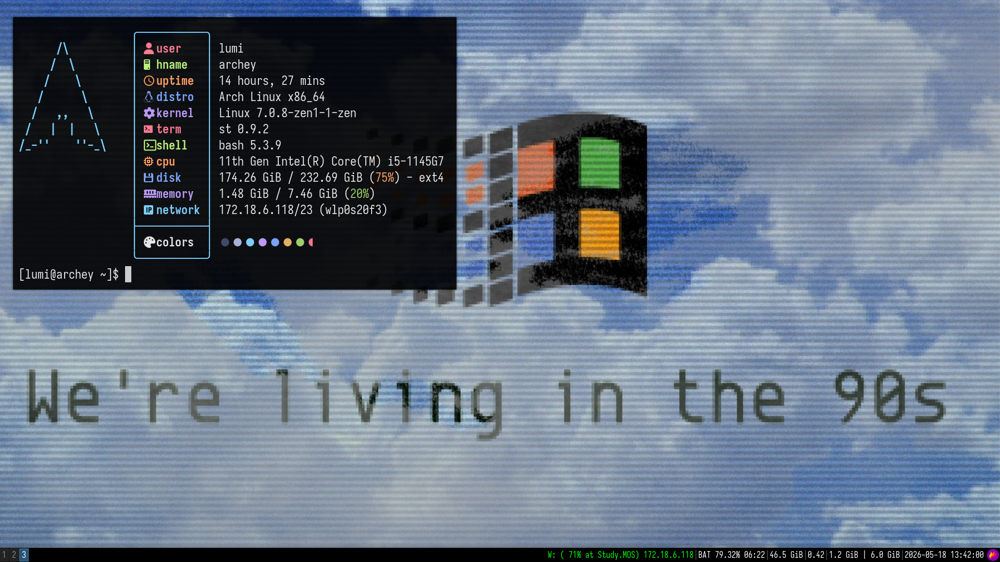

# Dotfiles-i3wm

**How to install:** 
- clone the following repo into ~/.config
- then cd into st and write ``make && sudo/doas make clean install``
- Well done , you have installed ~~my~~ (well maybe not mine) dotfiles!! :3
